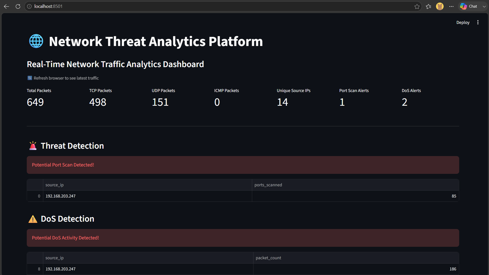
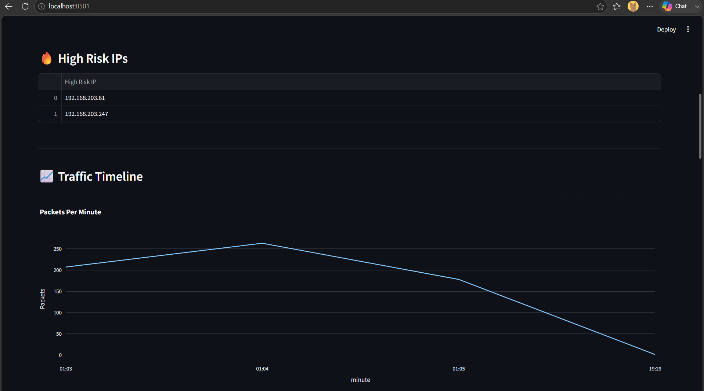
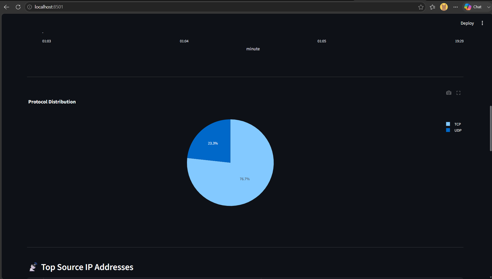
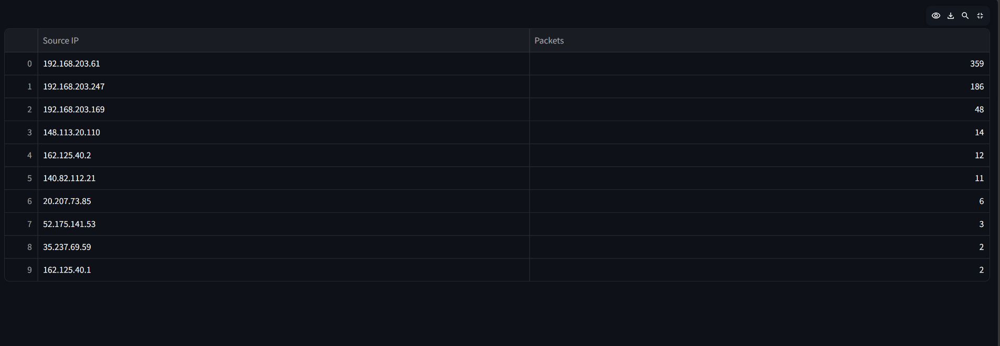
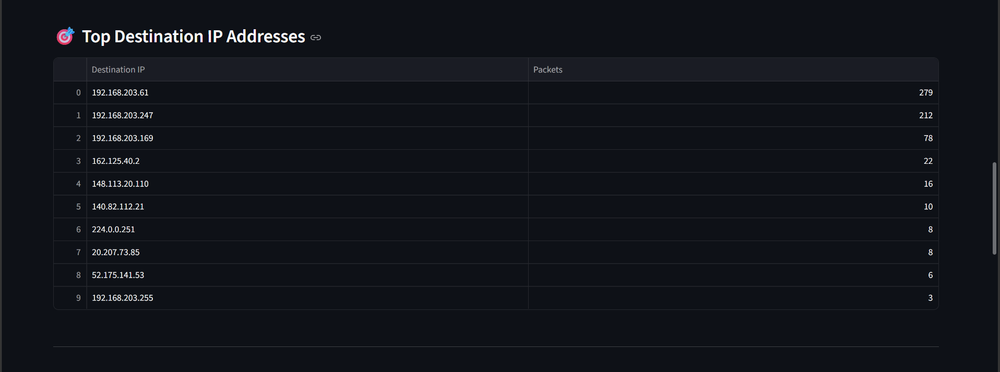
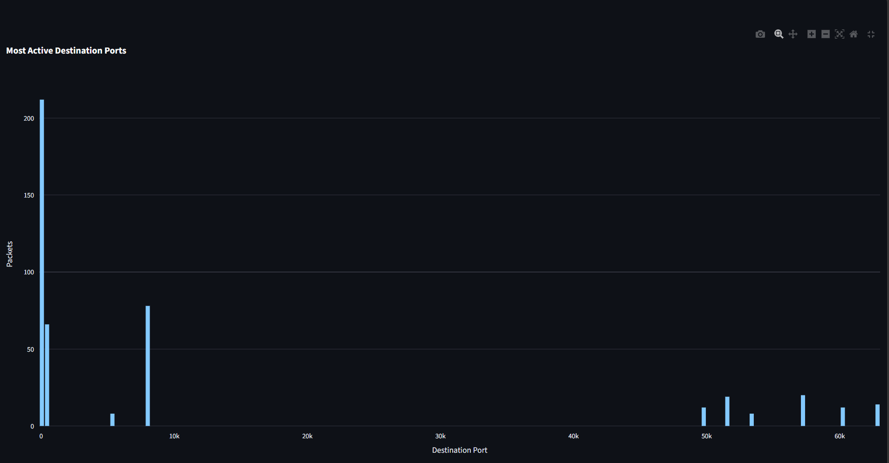
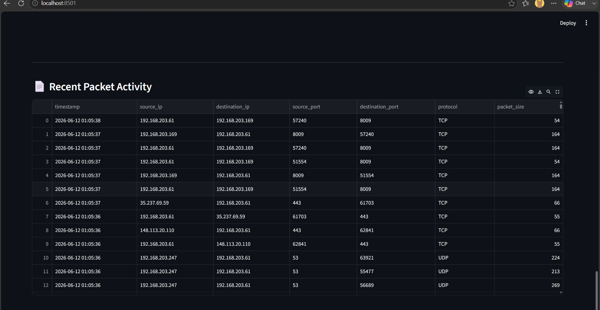

# 🌐 Network Threat Analytics Platform


---

## 📌 Project Overview

The Network Threat Analytics Platform is a real-time network monitoring and threat detection solution developed using Python, Scapy, MySQL, Streamlit, and Docker.

The platform captures live network packets, extracts critical networking information, stores packet data in a MySQL database, detects suspicious network activities, and visualizes network traffic through an interactive dashboard.

This project was developed to gain practical experience in:

- Computer Networking
- Network Security
- Packet Analysis
- Threat Detection
- Docker & Containerization
- Database Integration
- Real-Time Monitoring Systems

---

## 🚀 Key Features

### 📡 Packet Capture

- Live packet sniffing using Scapy
- Source IP detection
- Destination IP detection
- Protocol identification
- Source Port detection
- Destination Port detection
- Packet size monitoring

### 🗄 Database Integration

- MySQL packet storage
- Structured packet logging
- Historical traffic analysis

### 📊 Interactive Dashboard

- Real-time packet analytics
- Protocol distribution charts
- Traffic timeline visualization
- Top source IP analysis
- Top destination IP analysis
- Top destination port analysis

### 🚨 Threat Detection

- Port Scan Detection
- DoS Detection
- Suspicious IP Identification
- High-Risk IP Monitoring

### 🐳 Docker Integration

- Dockerized Streamlit Application
- Dockerized MySQL Database
- Docker Compose Multi-Container Setup
- Container Networking

---

## 🏗 System Architecture

```text
Network Traffic
        │
        ▼
Scapy Packet Sniffer
        │
        ▼
Packet Processing Engine
        │
        ▼
MySQL Database
(Docker Container)
        │
        ▼
Threat Detection Engine
        │
        ▼
Streamlit Dashboard
        │
        ▼
Network Analytics & Alerts
```

---

## 🛠 Technology Stack

| Technology | Purpose |
|------------|----------|
| Python | Core Development |
| Scapy | Packet Sniffing |
| MySQL | Database Storage |
| Streamlit | Dashboard |
| Docker | Containerization |
| Docker Compose | Multi-Container Management |
| Plotly | Data Visualization |
| Pandas | Data Analysis |

---

# 📸 Project Screenshots

## Dashboard Overview



---

## Network Analytics Dashboard



---

## Threat Detection Module



---

## Protocol Distribution Analysis



---

## Source & Destination IP Monitoring



---

## Traffic Visualization



---

## Packet Activity Logs



---

## 📂 Project Structure

```text
network-threat-analytics-platform/
│
├── app/
│   ├── packet_sniffer/
│   ├── database/
│   ├── dashboard/
│   ├── detection/
│   ├── monitoring/
│   └── utils/
│
├── data/
├── docker/
├── docs/
├── tests/
├── screenshots/
│   ├── cn1.png
│   ├── cn2.png
│   ├── cn3.png
│   ├── cn4.png
│   ├── cn5.png
│   ├── cn6.png
│   └── cn7.png
│
├── Dockerfile
├── docker-compose.yml
├── requirements.txt
└── README.md
```

---

## ▶️ Running the Project

### Clone Repository

```bash
git clone <repository-url>
cd network-threat-analytics-platform
```

### Start Containers

```bash
docker compose up --build
```

### Open Dashboard

```text
http://localhost:8501
```

---

## 🎯 Learning Outcomes

Through this project I learned:

- Network Packet Analysis
- TCP/IP Fundamentals
- Port-Based Communication
- Network Threat Detection
- Real-Time Monitoring Systems
- MySQL Database Design
- Docker Fundamentals
- Docker Networking
- Docker Compose
- Streamlit Dashboard Development

---

## 📈 Future Enhancements

- Machine Learning Threat Detection
- Intrusion Detection System (IDS)
- Email Alerting
- Real-Time Notifications
- Network Traffic Forecasting
- SIEM Integration
- Cloud Deployment

---

## 👨‍💻 Author

Developed as a hands-on Computer Networking, Cybersecurity, and Docker learning project.
